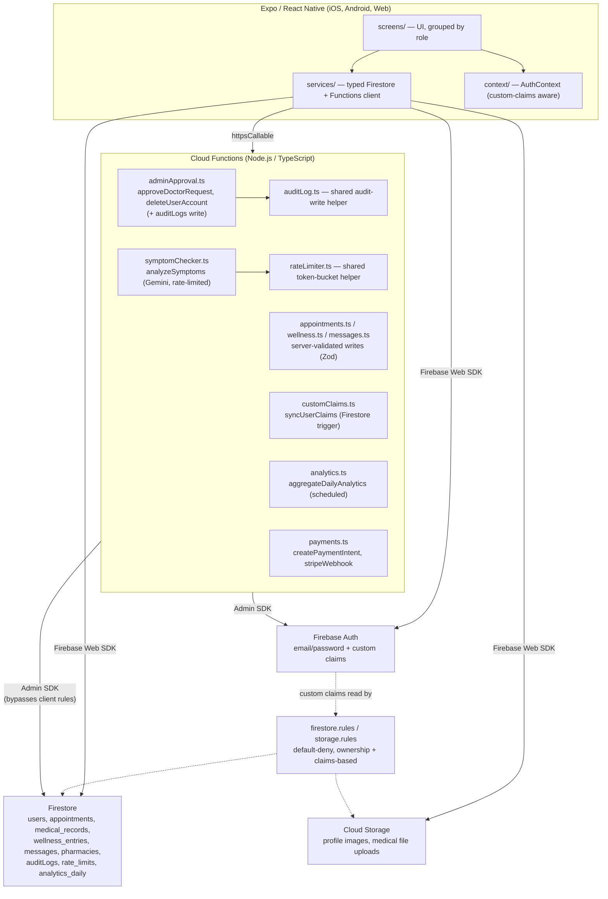

# CareConnect — Project Notes

This document is the architecture and design record for CareConnect. It intentionally describes only what is implemented — see `CareConnectApp/README.md` for the full setup guide and the "Known Limitations" section for what is out of scope.

## Problem Validation

See `CareConnectApp/README.md#problem-validation` for the full writeup. In short: booking a doctor's appointment at a small clinic is still largely phone-based with no visibility into real-time availability, and patients have no single place to track appointment history, message their doctor, or log day-to-day wellness. CareConnect is a small-scale, serverless exploration of that booking + communication loop, built as a portfolio-quality demonstration of mobile app architecture, Firebase security modeling, and testable service-layer design — not a production competitor to platforms like Zocdoc or Teladoc, which solve the same problem at a much larger operational scale.

## System Architecture

The ASCII box diagram that used to live here has been replaced with a rendered Mermaid diagram (renders natively on GitHub) — closing the "no true architecture diagram" gap named in both external audits.

There is no separate Node.js/Express application server and no MongoDB database — Firestore is the only database, and all business logic that needs elevated trust (role approval, account deletion, server-side data validation, payments, the AI call) runs in Cloud Functions rather than in the client.

## Firestore Collections

| Collection | Purpose | Key fields | Client-writable? |
|---|---|---|---|
| `users` | Patient, doctor, and admin profiles (discriminated by `role`) | `role`, `isVerified`, `isApproved` (doctors only), `claimsSyncedAt` | Create/update own doc only (role locked after create) |
| `appointments` | Booking records | `patientId`, `doctorId`, `date`, `status` | Read/update-status only — **create is server-side only** (`createAppointment` Cloud Function) |
| `medical_records` | Prescriptions, lab results, scans attached by a doctor | `patientId`, `doctorId`, `type` | Doctor may create/update their own authored records |
| `wellness_entries` | Daily patient self-reported wellness logs | `userId`, `mood`, `energy`, `stress` | Read own only — **create is server-side only** (`createWellnessEntry` Cloud Function) |
| `messages` | Per-appointment chat messages | `senderId`, `receiverId`, `appointmentId` | Read own only — **create is server-side only** (`sendMessage` Cloud Function) |
| `pharmacies` | Partner pharmacy directory (reference data) | `isPartner` | Admin-only write |
| `payments` | Stripe payment records | `userId`, `appointmentId`, `amount`, `status`, `stripePaymentIntentId` | Read own only — all writes server-side (`createPaymentIntent`/`stripeWebhook`) |
| `auditLogs` | Durable record of privileged admin actions | `actorId`, `targetUserId`, `action`, `createdAt` | Admin-read-only; **no client write, ever** |
| `rate_limits` | Internal per-uid token-bucket state | `tokens`, `lastRefill`, `action` | **No client access at all** (Admin SDK only) |
| `analytics_daily` | Daily rollup written by `aggregateDailyAnalytics` | `totalUsers`, `totalAppointments`, `appointmentsByStatus`, ... | Any signed-in user may read; write is server-side only |

There is still no full ERD/schema-migration tool (expected for a schemaless Firestore project — see "Known Tradeoffs"), but the table above is now accompanied by the Mermaid diagram above for a visual reference, and the table itself is now consistent with the code (verified against `firestore.rules`).

## Security Model

- **Firestore rules** (`firestore.rules`) scope every collection to its owning user (patient/doctor on an appointment, the authoring doctor on a medical record, the logged-in user on their own wellness entries) rather than allowing any authenticated client to read/write any document. There is no blanket `allow read, write: if true` or expiring test-mode rule.
- **Storage rules** (`storage.rules`) mirror the same ownership model for file uploads, namespaced by uid, and additionally constrain file size and content type.
- **Privileged mutations run server-side.** `approveDoctorRequest` and `deleteUserAccount` are Cloud Functions using the Firebase Admin SDK. Both independently look up the *caller's own* Firestore document (or, once synced, their tamper-proof custom claim — see below) to confirm `role === 'admin'` before doing anything — the caller's self-reported role or client-supplied claims are never trusted.
- **Server-side data validation.** `createAppointment`, `createWellnessEntry`, and `sendMessage` are now Cloud Functions (Zod-validated) rather than direct client Firestore writes — closing the gap where Firestore rules enforced *ownership* but not *field-shape/range* correctness (e.g. a `mood` value outside 1-5, or a `sendMessage` call forging a `receiverId` that doesn't match the referenced appointment).
- **Firebase custom claims (tamper-proof RBAC).** `functions/src/customClaims.ts`'s `syncUserClaims` Firestore trigger mirrors each user's `role`/`isApproved` into their Firebase Auth ID token as custom claims whenever their Firestore document changes. `firestore.rules`' `isAdmin()` now checks `request.auth.token.role` first (a value only the Admin SDK can set) and falls back to the Firestore-document lookup only for accounts whose claim hasn't synced yet. The client (`AuthContext.tsx`) watches its own document's `claimsSyncedAt` marker and forces an immediate ID-token refresh when it changes, rather than waiting up to an hour for the cached token to expire naturally. **Honesty note:** this has been implemented and unit-tested against a mocked Admin SDK, but has never been deployed to or exercised against a live Firebase project in this environment — "custom claims are actually set on live user accounts" is unverified, not claimed. A one-time backfill script for pre-existing accounts is at `functions/scripts/backfillCustomClaims.ts` (also unrun against a live project, for the same reason).
- **Per-user rate limiting.** `functions/src/rateLimiter.ts` implements a Firestore-backed token-bucket, applied to `analyzeSymptoms` (5 requests, refilling at 5/hour per uid) — the one billable third-party API call in the codebase, and the one both audits specifically flagged as unprotected against a compromised/malicious account driving unbounded cost.
- **Durable audit logging.** `functions/src/auditLog.ts` writes a permanent, admin-read-only `auditLogs` entry (actor, target, action, timestamp) on every `approveDoctorRequest`/`deleteUserAccount` call, in addition to (not instead of) the existing structured Cloud Logging output — closing the gap where "who approved/deleted which account and when" was only visible in ephemeral logs.
- **The one AI-adjacent secret** (`GOOGLE_GENAI_API_KEY`) is stored as a Cloud Functions secret, never as a client-bundled environment variable, and the callable function that uses it rejects unauthenticated callers. The same pattern is used for `STRIPE_SECRET_KEY`/`STRIPE_WEBHOOK_SECRET`.
- **App Check — implemented server-side, intentionally not enforced yet.** Every privileged/billable callable (`approveDoctorRequest`, `deleteUserAccount`, `analyzeSymptoms`, `createAppointment`, `createWellnessEntry`, `sendMessage`, `createPaymentIntent`) now explicitly sets `enforceAppCheck: false` (not merely omitted — a deliberate, documented decision) rather than silently having no App Check awareness at all. The reason it isn't `true`: this app uses the Firebase **Web** SDK inside Expo's managed React Native workflow, which has no verified native attestation provider (Play Integrity on Android, DeviceCheck/App Attest on iOS) available without ejecting to `@react-native-firebase`, which is out of scope for this project. Flipping `enforceAppCheck: true` without a matching client-side provider would reject 100% of legitimate calls, not just abusive ones — so this is called out as a real, understood limitation rather than a superficial flag flip. Rate limiting (above) is the primary abuse control that *is* fully functional today.

## Known Tradeoffs

- **Firestore over a relational database.** Chosen for tight integration with Firebase Auth and real-time listeners (used for chat) without standing up a separate backend. The cost is weaker relational integrity guarantees (no foreign keys) and the need to hand-roll composite indexes for compound queries — both are handled here (see `firestore.indexes.json`), but this is a real tradeoff compared to a Postgres-backed API with enforced foreign keys.
- **Client-side role selection at signup, gated by server-side approval AND now mirrored into tamper-proof custom claims.** The top item in the previous roadmap (custom-claims RBAC) is now implemented (see Security Model above), but the underlying tradeoff — a user still *chooses* `patient` or `doctor` at signup, rather than that being assigned by an authority — remains: custom claims make the *resulting* role tamper-proof once synced, but don't change the fact that self-selection is still the initial signal. The mitigating control (doctor accounts inert until admin-approved) is unchanged.
- **No dedicated backend server.** All logic that isn't a simple CRUD operation lives in Cloud Functions rather than a persistent Express/Node server. This keeps operational overhead near zero for a portfolio project, at the cost of cold-start latency and the constraints of Cloud Functions' execution model (no long-lived WebSocket server, for instance — which is why chat uses Firestore's own real-time listeners instead of a custom socket server).
- **Firestore-backed rate limiting instead of a dedicated cache (e.g. Redis).** A token bucket implemented via Firestore transactions is slower and more expensive per-check than an in-memory cache would be, but requires no additional infrastructure — a reasonable tradeoff at this project's scale and request volume, revisited if `analyzeSymptoms` traffic ever became high enough for Firestore read/write costs on the `rate_limits` collection to matter.
- **App Check implemented but not enforced** (see Security Model above) — a real, disclosed gap rather than a silently-absent one.

## Testing Strategy

- **Service layer (`CareConnectApp/src/services/*`):** unit-tested against a mocked `firebase/firestore` and `firebase/functions` SDK, covering input validation, query-shape assertions, pagination cursor behavior, and error translation. `collectCoverageFrom` now also includes `src/context/**`, with an enforced `coverageThreshold` (70% statements/lines, 65% functions, 55% branches) so coverage regressions fail CI rather than silently shrinking.
- **Cloud Functions (`functions/src/__tests__/*`):** unit-tested by invoking the exported `onCall`/trigger handlers' `.run()` method directly with mocked `firebase-admin`, now covering every function in the codebase (`adminApproval.ts`, `symptomChecker.ts`, `appointments.ts`, `wellness.ts`, `messages.ts`, `customClaims.ts`, `analytics.ts`, `payments.ts`, `rateLimiter.ts`) — previously only `adminApproval.ts` had any tests.
- **Firestore/Storage Security Rules — now covered by real Emulator Suite integration tests.** This was the single most consequential testing gap named by both audits. `functions/src/__tests__/rules/firestore.rules.test.ts` and `storage.rules.test.ts` use `@firebase/rules-unit-testing` against a real (locally emulated) Firestore/Storage instance — not a mock — asserting `assertSucceeds`/`assertFails` against the actual `firestore.rules`/`storage.rules` files, covering ownership checks, the custom-claims-based `isAdmin()` path, the new "writes are server-side only" rules, and the default-deny catch-all. **This was actually run in this environment** (Java 17 + globally installed `firebase-tools` 14.21.0 were both available): 29/29 tests pass against the real Firestore and Storage emulators via `firebase emulators:exec --project demo-careconnect --only firestore,storage "npm run test:rules"` (see `functions/package.json`'s `test:rules:local` script and `.github/workflows/ci.yml`'s `firestore-rules` CI job, which runs this on every push/PR).
- **Flaky test fixed.** `AuthContext.test.tsx` previously showed nondeterministic pass/fail behavior under repeated identical runs (reproduced by the portfolio-evaluation audit). The fix: explicit `cleanup()` + `unmount()` after every test (rather than relying solely on implicit RNTL auto-cleanup), and a ref-guarded effect in the test harness so `onReady` fires exactly once regardless of dependency-identity churn across renders. Re-verified via 3 consecutive full-suite runs with identical results. `--detectOpenHandles` was also added to the app's `test`/CI script to surface any future lingering timer/listener before it causes similar flakiness.
- **Still not covered:** there are no end-to-end tests (Detox/Maestro) of a full user journey (sign-up → admin approval → booking → chat), and screen-level component tests (rendering, user interaction) still don't exist for any of the 24 screens — only the service layer, one context provider, and now the security rules themselves are tested. This remains named as future work rather than hidden.

## Future Improvements

- A genuine end-to-end test suite (Detox/Maestro) covering the full sign-up → approval → booking → chat journey
- Screen-level component tests (React Native Testing Library) for the 24 screen components, currently at 0% coverage
- A real CD pipeline (Firebase Hosting/Functions deploy on merge to `main`) with separate dev/staging/prod Firebase projects
- A native App Check attestation provider (would require ejecting to `@react-native-firebase/app-check`, or moving to a fully native RN Firebase SDK) so `enforceAppCheck: true` can be turned on for real
- Firebase Performance Monitoring + Sentry/Crashlytics client-side error tracking
- Extending the new `src/components/` shared UI library's adoption to the remaining screens beyond the 3 refactored in this pass
- A live Stripe webhook endpoint verified against a real Stripe test-mode account (the code exists in `functions/src/payments.ts`'s `stripeWebhook`, but has never received a real webhook call in this environment)

## Incident Response / Rollback Runbook

See `functions/RUNBOOK.md` for the documented incident-response and rollback procedure for the Cloud Functions layer (a Staff-level-quality item named in the portfolio audit). It has not been exercised against a live incident, since there is no live deployment — it documents the intended procedure, not a battle-tested one.

## Lessons Learned

- **Trust boundaries are worth re-deriving from first principles per-endpoint, not applying uniformly.** The original codebase's single biggest defect (client-controlled role escalation) came from treating "the client already validated this" as sufficient. The fix pattern used throughout this remediation — re-verify the caller's authority *and* the referenced entities' state, server-side, inside the function that performs the privileged action — generalizes cleanly (it's the same pattern in `adminApproval.ts`, `appointments.ts`, `messages.ts`, and `payments.ts`), which suggests it should have been the default posture from the start rather than a remediation.
- **A "gap you disclosed" and "a gap you fixed" are both valuable, but they're not the same claim, and conflating them erodes trust.** This project's documentation style — explicitly separating "implemented," "implemented but unverified in this environment," and "not implemented" — was called out by both audits as a genuine differentiator. Maintaining that discipline through this remediation pass (e.g. flagging custom claims and the Emulator Suite rules tests as *written* vs. *actually run*) took more care than writing the code itself, and is the habit most worth carrying into future projects.
- **Rate limiting and audit logging are cheap to add early and annoying to retrofit.** Both were architecturally simple additions (a Firestore transaction; an extra `.add()` call) once identified, but would have been easy to skip entirely if not explicitly named by an external review — a reminder that "add this later" for security/observability primitives often means "add this only when someone asks."
